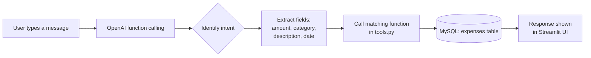

# Expense Tracker

Most expense trackers make you fill out forms. This one lets you just tell it what you spent.

An AI-powered personal expense tracker built with Streamlit, OpenAI function calling, and MySQL. Use natural language to add, find, update, delete, and summarize expenses.


## Features

- Chat-first expense management
- Add expenses, such as: `I spent ₹340 on lunch today`
- View expenses by date range or category
- Update or delete a recorded expense
- Get monthly and category spending summaries
- Live month-to-date cards for total expenses, top category, and transaction count
- Recent-expense sidebar

## How it works

The assistant uses OpenAI function calling to translate natural language requests into structured operations. When you type something like `I spent ₹340 on lunch today`, the model identifies the intent (add, find, update, delete, or summarize) and extracts the relevant fields (amount, category, description, date), then calls the matching function in `tools.py`, which executes the corresponding MySQL query against the `expenses` table.



## Project files

| File | Purpose |
| --- | --- |
| `expense_assistant.py` | Main Streamlit assistant interface |
| `main.py` | Command-line version of the assistant |
| `tools.py` | MySQL database functions used by both interfaces |
| `expense_dashboard.py` | Alternative dashboard-first interface |
| `req.txt` | Python dependencies |

## Prerequisites

- Python 3.10 or later
- A MySQL server with an `analytics` database
- An OpenAI API key (uses gpt-5.6-sol by default)

## Setup

1. Create and activate a virtual environment.

   ```bash
   python -m venv myenv
   source myenv/bin/activate
   ```

2. Install the dependencies.

   ```bash
   pip install -r req.txt
   ```

3. Create a `.env` file in the project root.

   ```env
   OPENAI_API_KEY=your_openai_api_key
   ```

4. Configure the MySQL connection in `tools.py` for your local database.

5. Create the `expenses` table if it does not already exist.

   ```sql
   CREATE TABLE expenses (
       id INT AUTO_INCREMENT PRIMARY KEY,
       amount DECIMAL(10, 2) NOT NULL,
       category VARCHAR(100) NOT NULL,
       description VARCHAR(255),
       expense_date DATE NOT NULL
   );
   ```

## Run the app

Start the assistant-first UI:

```bash
streamlit run expense_assistant.py
```

Then open the local URL shown by Streamlit, usually `http://localhost:8501`.

To use the terminal version instead:

```bash
python main.py
```

## Example prompts

```text
I spent ₹340 on lunch today
Show my expenses this month
What did I spend most on this month?
Change my coffee expense from yesterday to ₹180
Delete the groceries expense from 10 September
Show my monthly spending summary
```

## How month-to-date cards work

The cards at the top of the UI use the same period: from the first day of the current month through today.

- **Total Expense this month**: combined spending in that period
- **Top expense category**: the category with the largest total in that period
- **Total transactions**: number of recorded expenses in that period

## Notes

- Keep `.env` private and do not commit API keys.
- The MySQL connection settings currently live in `tools.py`; use credentials appropriate for your own environment.
